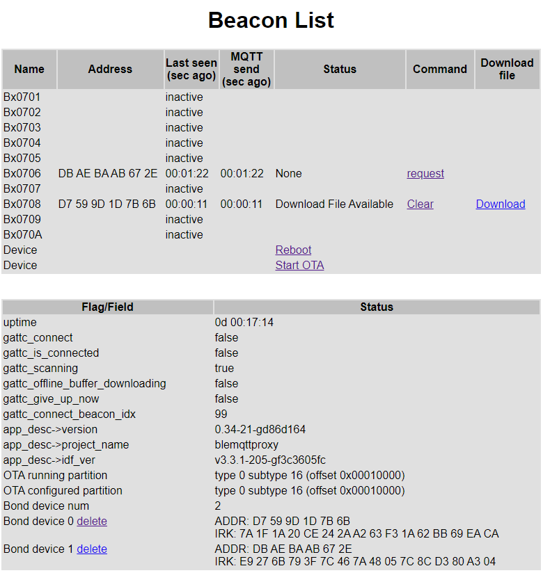
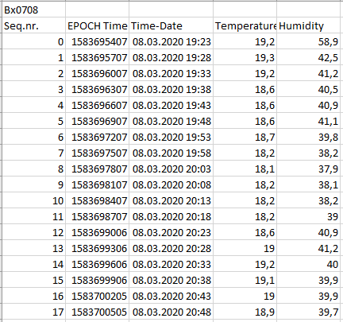

# A Bluetooth to MQTT Proxy (bleMqttProxy)

## Overview

**bleMqttProxy** is a software for ESP32 boards with display and at least one push button. It acts as a proxy or gateway service for BLE beacons to a configurable MQTT broker using a WiFi connection.

Using the push button you can change the information to be displayed (e.g. detailed page per Beacon, local sensors, statistics) or activate/deactivate the Beacons used with this Proxy.

The code is designed for:

- an ESP32 board with OLED display and two buttons (reset and an application usable button). The display is based on the SSD1306 controller and has a resolution of 128x64 pixels. (This board can be purchased using search for "Wemos Lolin ESP32 OLED Module"). 
- an M5Stack (Fire), see [M5Stack Fire](https://m5stack.com/collections/m5-core/products/fire-iot-development-kit?variant=16804798169178), equipped with three push buttons and an ILI9341 based 320x240 px TFT display and diverse extension possibilities.

### Provided Services

A web server is available providing status information of the Beacons (e.g., when the beacon was last seen, last MQTT message send, address) and of the proxy service (e.g., uptime, version). Also a reboot or start a OTA Update (over-the-air update) can be initiated.

The BLE beacons provide an offline buffer. Using web server commands a download to the Proxy can be triggered, which, if then available, can be downloads using a browser.

### Available Buttons on Board

There is one user defined tactile push button (connected to P0) and a reset button.

### Available Display on Board

On board is an OLED display with a resolution of 128x64 pixels attached to an SSD1306 controller attached using I2C.

| Controller | Description                                                  | Data Sheet                                                   | TWI Address |
| ---------- | ------------------------------------------------------------ | ------------------------------------------------------------ | ----------- |
| SSD1306    | 128 x 64 Dot Matrix OLED/PLED Segment/Common Driver with Controller | [SSD1306 Advanced Information](Documents/SSD1306%20Datasheet%20for%20096%20OLED.pdf) | 0x3C        |

### Example Data and Beacon used throughout this Document

In this Readme we use a single BLE beacon device with the following address `D7:59:9D:1D:7B:6B`. The device name for this Beacon is set to `Bx0708` and will be constructed using its major and minor id which will be set to: Major ID `0x07` and Minor ID `0x08`, preceded by `Bx` (as in Beacon).

The device IP address is set to `192.168.2.156`.

## Programming the Device

### Installing ESP-IDF

If not already done, install Epressif ESP-IDF, see [ESP-IDF Get Started](https://docs.espressif.com/projects/esp-idf/en/stable/get-started/).

### Updating to a specific ESP-IDF version

Use `git checkout version` to checkout a specific version. Afterwards, if necessary, update the submodules to the correct commit

```
git submodule update --recursive
```

If necessary, use the following command to get tools downloaded and installed

```
~/esp-idf/install.sh
```

#### Configure using menuconfig

Start with calling `menuconfig` to make the specific bleMqttProxy configuration and the ESP-IDF basic configuration.

**Important**: For example, MQTT you can set MQTT to 0 to disable or to 1 to enable MQTT messages, which will be put in the database by the script afterwards.

#### Using the correct Python version

According to the ESP-IDF 3.3.1 documentation, currently only Python 2.7 is supported. So, if on your system Python 3 is the default Python version, you need to implement the steps as shown in [Build System CMake - phython](https://docs.espressif.com/projects/esp-idf/en/stable/api-guides/build-system-cmake.html).

### Flashing the App

#### Step 1 (optional): Erase all ESP32 flash memory if necessary

```
make erase_flash
```


#### Step 2: Make and Flash the Partition Table and Application

`make partition_table-flash`: will flash the partition table with esptool.py.

`make flash`: Will flash everything including the partition table.

`make flash-app`: Will build the application and flash everything including the partition table.

#### Step 3: Use Monitor

Use `make monitor` to get the console messages to check that everything is fine, alternatively use `putty` (on the appropriate COM port and speed as defined using `menuconfig`).

#### Step 4 (optional): Getting Information on ESP32 chip on board

Use `esptool.py --chip esp32 --port /dev/COM6 flash_id` to get more information on the ESP32 chip used on your board:

```
$ python2.7 /home/AKAEM/esp/esp-idf/components/esptool_py/esptool/esptool.py --chip esp32 --port /dev/COM6 flash_id
esptool.py v2.8
Serial port C:/msys32/dev/COM6
Connecting....
Chip is ESP32D0WDQ6 (revision 1)
Features: WiFi, BT, Dual Core, 240MHz, VRef calibration in efuse, Coding Scheme None
Crystal is 40MHz
MAC: 84:0d:8e:25:92:34
Uploading stub...     
Running stub...
Stub running...
Manufacturer: c8
Device: 4018
Detected flash size: 16MB    
Hard resetting via RTS pin...
```


### Update the App using OTA

You can use OTA (over-the-air updates) to update the app. Use `menuconfig` to configure an secure web server and path/file name, and put the application image created during application build on this server.

An introduction is given by Espressif [here](https://github.com/espressif/esp-idf/tree/master/examples/system/ota), in particular creating the certificate and running the https server. But, I experienced problems using Windows 10 with `openssl s_server` with not completed downloads of the firmware to flash, thus moved to a Raspberry Pi server.

This command line creates the certificate:

```
openssl req -x509 -newkey rsa:2048 -keyout ca_key.pem -out ca_cert.pem -days 365 -nodes
```

and this command line starts the server:

```
openssl s_server -WWW -key ca_key.pem -cert ca_cert.pem -port 8070
```


## Functionalities

The main purpose of this device:

- Retrieve data
  - from a BLE beacon (e.g. temperature, humidity, acceleration data)
- Display data
  - on the OLED display
  - on the web interface
- Forward data
  - to a MQTT broker, to be displayed with e.g. Grafana or to be used for home automation or alerting
- Provide a service
  - to retrieve and download the Beacons offline buffer data
- Retrieve Commands
  - from the web interface

### Retrieve Data from a BLE beacon

Retrieving data from a BLE beacon is done more or less automatically. The major step is to configure the beacon using `menuconfig` and to activate the relevant beacons. After that, the beacon data of activated beacons will be updated and, if configured, forwarded to the MQTT broker.

#### Configuration

Step 1) Use `menuconfig`

Step 2) Checkmark the relevant device and configure major and minor id, as well as the name, according to the ble_beacon software and number of devices you're using.

Step 3) Set the number of devices configured

Step 4) Set the number of devices to use (can be lower than the number of devices configured)

Step 5) Set the BLE device active mask. This is the devices which are activated when you first flash the board, but can be changed using the push button (to activate/deactivate) a device later on.

Step 6) Configure whether the device active mask is to store in persistent memory.

Step 7) Configure the proximity threshold to activate/identify a device by "touching" the board. (not yet implemented)

Step 8) Configure the size of the offline buffer. This value must be the same as in the ble_beacon software, too. It defaults to 1250 entries.

### Display Data on the OLED Display

If you push the application button, you can switch through the different pages using a short push, and activate/deactivate beacons (in Beacon data screens) and reset statistics (in Statistics screen) using a long push.

The different screens and the button functionalities are given in the section [Device Usage using Push Button]([#device-usage-using-push-button).

**Warning**: the application button and the reset button are close together, take care not to accidentially reset the board.

### Display Data on the Web Interface

Beacon status information, device actions and the offline buffer download functionality can be controlled using the web interface.

To start the web interface, visit the URL `http://192.168.2.156/csv?cmd=list`. From this starting page, you can set commands, delete bonds, etc.

More information is given in the section [Device Usage using Web Interface](#device-usage-using-web-interface).

### Forward Data to a MQTT Broker

Forwarding retrieved sensor data is done automatically, but needs to be configured first.

#### Configuration

Step 1) Use `menuconfig`

Step 2) Configure `MQTT` to true (1)

Step 3) Configure the MQTT brokers URL, port, user name and passsword

Step 4) To not flood the MQTT broker, you can set a minimum wait interval, i.e. the device waits the given number of seconds before sending the next MQTT message to the broker.

### Using the Service to Retrieve Beacons Offline Data

The device can be used to retrieve the offline buffer data from a BLE beacon and to provide a download using the web interface. If you click on `Request`, essentially the following process is started:

Step 1) The next time we retrieve an (connectable) advertisement from the respective beacon we stop scanning for advertisements.

Step 2) initiate a connection to the GATT server.

Step 3) as soon as we successfully connected to the server, the relevant notifications and indications are activated.

Step 4) We write the command `Report Records, All` to the Bluetooth service

Step 5) in turn we receive all data sets and store them in an array

Step 6) The connection is closed by the server

Step 7) the data is prepared and now available for download.


## Usage

### Device Usage using Push Button

There is one tactile push button available for application usage (in addition to the reset button). This button can be used to switch between the different screens (e.g., showing detailed BLE Beacon information, device information, status and version screen). Since there's only one button available, short and long push is used in a context sensitive manner.

#### Different Screens and button actions

This section gives an overview on the different screens and the respective button actions.

| Screen         | Number of pages                                      | Description                                                  | Button action (short push)                                   | Button action (long push) |
| -------------- | ---------------------------------------------------- | ------------------------------------------------------------ | ------------------------------------------------------------ | ------------------------- |
| Splash         | one                                                  | The splash screen is shown for a limited time directly after startup | n/a                                                          | n/a                       |
| Empty          | one                                                  | The empty screen can be used as a "screen saver". After a limited time, the display is shut down. Exceptions occur for... | Turn display on, show last screen shown again.               | n/a                       |
| Beacon details | Multiple, one page per  configured beacon            | Information screen with detailed information, see details below. | Move to next **"Beacon details"** screen or **"last seen"** screen | toggle active/inactive    |
| Last seen      | Multiple, each page shows a list with max. 5 entries | Shows when the beacon was last seen and when the MQTT message was last send. | Move to next **"Last seen"** screen or **"App version"** screen | n/a                       |
| App version    | one                                                  | Information on the application and IDF version, project name, IP address, active beacon mask. | Move to next **"Statistics"** screen                         | n/a                       |
| Statistics     | one                                                  | Information on uptime, WiFi/MQTT status, WiFi connections/failures, MQTT messages send/failed. | Move to next **"Beacon details"** screen again               | Clear statistics values   |

##### Screen "Splash"


##### Screen "Beacon details"


##### Screen "Last seen"


##### Screen "App version"


##### Screen "Statistics"


### Device Usage using Web Interface

You can reach the Web Interface using the following address in the browser, with the device's IP address `192.168.2.156`:

```
http://192.168.2.156/csv?cmd=list
```

The following figure shows a screenshot of the Web Interface:



The Web Interface is intended for getting the status of the beacons configured for the device, to initiate commands, and status and commands of the proxy device.

#### Beacon List of BLE Beacon devices

The beacon list shows a table of the configured beacons, with information about name, address, some status information and commands.

##### Information and Commands per BLE Beacon

| Column              | Description                                                  | Example                                 |
| ------------------- | ------------------------------------------------------------ | --------------------------------------- |
| Name                | Name of the BLE Beacon device, build using BLE Beacons major and minor id, MAJ and MIN, set as "Bx_MAJ_MIN". | Bx0708                                  |
| Address             | Bluetooth device address                                     | D7:59:9D:1D:7B:6B                       |
| Last seen (sec ago) | The time gone since the device was last seen, or, if the beacon is not configured as active: "inactive" | 00:01:35 (for 1 Minute and 35 secs ago) |
| MQTT send (sec ago) | The time gone since the last MQTT message was send (or could be send). | 00:01:35                                |
| Status              | The status of the offline buffer download from beacon. See the list "Status" below. | Download in progress                    |
| Command             | The available commands regarding offline buffer download. See the list "Command" below. | Cancel                                  |
| Download file       | If the offline buffer download file is available, the link is shown, else its empty. | Download                                |

###### Status

| Status                  | Description                                                  |
| ----------------------- | ------------------------------------------------------------ |
| None                    | No offline buffer download requested and non available.      |
| Download Requested      | Offline buffer download is requested. Currently waiting for the next BLE (connectable) advertising packet to start a connection to the device and download. |
| Download in progress    | The connection to the device and the offline buffer download is in progress. |
| Download File Available | The download of the device's offline buffer is completed and the file is available for download. |
| Unknown, Invalid        | Should not happen.                                           |

###### Command

| Command | Description                                                  |
| ------- | ------------------------------------------------------------ |
| Request | Request to download the device's offline buffer.             |
| Cancel  | Cancel the currently requested download.                     |
| Clear   | Clear the already downloaded offline buffer and free memory again. |

#### Device Commands and Device status

##### Commands regarding Device

| Command       | Description                                                  |
| ------------- | ------------------------------------------------------------ |
| Reboot        | Reboot the proxy device                                      |
| Start OTA     | Initiate the OTA process, currently there's no additional information the status given. |
| Delete (bond) | Removes a device from the security database list of peer device. |

##### Status information regarding Device

Most of the flags are just for debug reasons and will be removed in the future is the process stable.

| Flag/Field                       | Description                                                  |
| -------------------------------- | ------------------------------------------------------------ |
| Uptime                           | Show the device uptime in "DD d HH:MM:SS"<br />e.g. "3d 11:02:34" |
| gattc_connect                    | Flag, initiate connection to device "gattc_connect_beacon_idx", is true until canceled or DISCONNECT_EVT |
| gattc_is_connected               | Flag, currently connected to peer                            |
| gattc_scanning                   | Flag, true if in scanning process                            |
| gattc_offline_buffer_downloading | Flag, true if connection is initiated and cleared if download completed. Necessary to distinguish between completed download or abort. |
| gattc_give_up_now                | Flag, true if e.g. cancel is pressed during download process. Will wait for a timeout on the current activity and stop before next try, or, if no connection initiated, executed directly. |
| gattc_connect_beacon_idx         | Number of beacon to connect to or in connection with.        |
| app_desc->version                | The git version of the app software, e.g. 0.34-21-gd86d164   |
| app_desc->project_name           | The configured project name, e.g. blemqttproxy               |
| app_desc->idf_ver                | The ESP-IDF version used, e.g. v3.3.1-205-gf3c3605fc         |
| OTA running partition            | The currently running OTA partition, e.g. <br />type 0 subtype 16 (offset 0x00010000) |
| OTA configured partition         | The newly configured OTA partition, e.g.<br />type 0 subtype 16 (offset 0x00010000) |
| Bond device num                  | Number of bond devices, e.g. 2                               |
| Bond device NUM                  | For each bond device NUM, the address and the IRK is given, e.g.<br />ADDR: D7 59 9D 1D 7B 6B <br />IRK: 7A 1F 1A 20 CE 24 2A A2 63 F3 1A 62 BB 69 EA CA |

#### Downloading Offline Buffer

If you click on the link "Download", the offline buffer data retrieved from the Beacon will be provided and downloaded as a CSV file. Imported in Excel you get the following result:




## BLE beacon announcement functionality

To add a not yet active beacon to this proxy **move the beacon close to the proxy or vice versa**.
After a confirmation with a **push** in between 2 secs the device will be added. Only configured beacons can be made active.
The current configuration of active beacons will be stored in NVS.


##

### Beacons

#### ble_beacon v3

D (10444) BLEMQTTPROXY: 0x3ffba598   02 01 04 1a ff 59 00 02  15 01 12 23 34 00 07 00  |.....Y.....#4...|
D (10454) BLEMQTTPROXY: 0x3ffba5a8   02 c3 5f c9 62 bd 56 3d  bc fe 3c 09 0b ac        |.._.b.V=..<...|

    Flags:      02 01 04
    Length:     1A
    Type:       FF
    Comp.Id:    59 00
    Beac.Type:  02 15
    ...         01 12 23 34 00 07 00 02
    ...         c3
    Temperature 5f c9
    Humidity    62 bd
    X           56 3d
    Y           bc fe
    Z           3c 09
    Battery     0b ac


#### ble_beacon v4

D (35714) BLEMQTTPROXY: 0x3ffba594   02 01 06 13 ff 59 00 00  07 00 06 5f e9 68 f9 c2  |.....Y....._.h..|
D (35724) BLEMQTTPROXY: 0x3ffba5a4   00 d2 00 ba 40 0b ca                              |....@..|

    Flags:      02 01 06
    Length:     13
    Type:       FF
    Comp.Id:    59 00
    Beac.Type:  00 [07]     (for the sake of simplicity just take the 07 as Beac.Type, aargh)
    ...         00 06
    Temperature 5f e9
    Humidity    68 f9
    X           c2 00
    Y           d2 00
    Z           ba 40
    Battery     0b ca

# TODO

- watchdog usage and configuration
- offline buffer download process
- headless mode
- mqtt configuration
- range of values
- ble devices
- ota configuration
- touch beacon/device to activate

# M5Stack Fire configuration

| Configuration             | Value |
| ------------------------- | ----- |
| DISP_SPI_MOSI             | 23    |
| DISP_SPI_CLK              | 18    |
| DISP_SPI_CS               | 14    |
| ILI9341_DC                | 27    |
| ILI9341_RST               | 33    |
| ILI9341_BCKL              | 32    |
| ILI9341_INVERT_DISPLAY    | 1     |
| ILI9341_BCKL_ACTIVE_LVL   | 1     |
| LVGL_TFT_DISPLAY_SPI_VSPI | 1     |

# Strange issues, things to remember, ...

### region `iram0_0_seg' overflowed by 1673 bytes

```
$ make size-components
Toolchain path: /opt/xtensa-esp32-elf/bin/xtensa-esp32-elf-gcc
Toolchain version: crosstool-ng-1.22.0-80-g6c4433a5
Compiler version: 5.2.0
App "blemqttproxy" version: 0.4-1-g724391e-dirty
LD build/blemqttproxy.elf
c:/msys32/opt/xtensa-esp32-elf/bin/../lib/gcc/xtensa-esp32-elf/5.2.0/../../../../xtensa-esp32-elf/bin/ld.exe: C:/msys32/home/AKAEM/esp/bleMqttProxy/build/blemqttproxy.elf section `.iram0.text' will not fit in region `iram0_0_seg'
c:/msys32/opt/xtensa-esp32-elf/bin/../lib/gcc/xtensa-esp32-elf/5.2.0/../../../../xtensa-esp32-elf/bin/ld.exe: IRAM0 segment data does not fit.
c:/msys32/opt/xtensa-esp32-elf/bin/../lib/gcc/xtensa-esp32-elf/5.2.0/../../../../xtensa-esp32-elf/bin/ld.exe: region `iram0_0_seg' overflowed by 1673 bytes
collect2.exe: error: ld returned 1 exit status
make: *** [C:/msys32/home/AKAEM/esp/esp-idf/make/project.mk:483: /home/AKAEM/esp/bleMqttProxy/build/blemqttproxy.elf] Fehler 1
```

See [https://esp32.com/viewtopic.php?t=8460](https://esp32.com/viewtopic.php?t=8460)

Call `make size-components` will give no information, since it stops with the error above, too. 

You can temporarily bump IRAM to 0x40000, call again, and retrieve the information required:

- Change in file `~/esp/esp-idf/components/esp32/ld/esp32.ld`  the line

  ```
  /* IRAM for PRO cpu. Not sure if happy with this, this is MMU area... */
    iram0_0_seg (RX) :                 org = 0x40080000, len = 0x20000
  ```

  to 

  ```
  iram0_0_seg (RX) :                 org = 0x40080000, len = 0x40000 
  ```

- Call `make size-components`

  ```
  $ make size-components
  Toolchain path: /opt/xtensa-esp32-elf/bin/xtensa-esp32-elf-gcc
  Toolchain version: crosstool-ng-1.22.0-80-g6c4433a5
  Compiler version: 5.2.0
  App "blemqttproxy" version: 0.4-1-g724391e-dirty
  Python requirements from C:/msys32/home/AKAEM/esp/esp-idf/requirements.txt are satisfied.
  Total sizes:
   DRAM .data size:   20856 bytes
   DRAM .bss  size:   96928 bytes
  Used static DRAM:  117784 bytes (   6796 available, 94.5% used)
  Used static IRAM:  132745 bytes ( 129399 available, 50.6% used)
        Flash code: 1045371 bytes
      Flash rodata:  334080 bytes
  Total image size:~1533052 bytes (.bin may be padded larger)
  Per-archive contributions to ELF file:
              Archive File DRAM .data & .bss   IRAM Flash code & rodata   Total
                   libbt.a        453      0    366     301204   137819  439842
             libnet80211.a        937      0  11492     109778    21554  143761
              libmbedtls.a        100    264     30     102488    20299  123181
   libc-psram-workaround.a       1514     28  12228      83961     8093  105824
                 liblwip.a         21      0      0      89004    15431  104456
                 libmain.a       1036  53390     10      20469    19978   94883
             libbtdm_app.a        337   2386  21158      61200     4119   89200
                 liblvgl.a       3046  34355     44      35325    12208   84978
                   libpp.a       1317      0  23872      38292     5096   68577
                libesp32.a       2440   2669  14133      17744    22658   59644
                  libphy.a       1604    930   6483      30555        0   39572
               libdriver.a        123     77   4180      13587    16273   34240
                  libwpa.a          0    686      0      21577     2577   24840
             libfreertos.a       4148    776  14228          0     1986   21138
                 libmqtt.a          0      0      0      12320     5820   18140
      libesp_http_server.a          0      8      0      10305     6538   16851
       libwpa_supplicant.a          0      0      0      13317     2318   15635
            libnvs_flash.a          0     32      0      11017     3604   14653
               libnghttp.a          0      0      0      10714     3873   14587
      libesp_http_client.a          0      0      0       7397     3478   10875
              libcoexist.a       2012     28   3862       4386      315   10603
                  libsoc.a        160      4   5304        703     4231   10402
            libspi_flash.a         24    291   5999       1350      955    8619
                  libvfs.a        240    103      0       6579      555    7477
        libtcp_transport.a          0      0      0       5471     1998    7469
                  libgcc.a          4     20    104       5572      888    6588
   libbootloader_support.a          0      4      0       3715     2227    5946
        libtcpip_adapter.a          0    124      0       3496     2323    5943
                 libheap.a        840      8   2715       1363      993    5919
              libesp-tls.a          0      4      0       2679     1977    4660
               libstdc++.a          8     20      0       2689     1253    3970
           libapp_update.a          0     12    102       2174     1674    3962
                libefuse.a         36      4      0        942     2248    3230
               libnewlib.a        152    272    790       1018      241    2473
                  librtc.a          0      4   2247          0        0    2251
             liblvgl_tft.a          0     10     75       1417      276    1778
              libpthread.a         16     12    236        771      683    1718
                  liblog.a          8    268    458        694      114    1542
               libbutton.a          0      0      0       1184      172    1356
      libsmartconfig_ack.a          0      1      0        960      349    1310
                 libcore.a          0     29      0        825      302    1156
          libesp_ringbuf.a          0      0    739          0      207     946
                libparam.a          0      0      0        528      199     727
                  libhal.a          0      0    519          0       32     551
                  libcxx.a          0      0      0         11        0      11
   liblvgl_esp32_drivers.a          0      0      0         10        0      10
  libxtensa-debug-module.a          0      0      8          0        0       8
                 libwpa2.a          0      1      0          0        0       1
                  libwps.a          0      1      0          0        0       1
             libethernet.a          0      0      0          0        0       0
                 libmesh.a          0      0      0          0        0       0
  ```

- Don't forget to change IRAM in file `~/esp/esp-idf/components/esp32/ld/esp32.ld`  back to the original value.

- For comparison, without psram-workaround enabled:

  ```
  $ make size-components
  Toolchain path: /opt/xtensa-esp32-elf/bin/xtensa-esp32-elf-gcc
  Toolchain version: crosstool-ng-1.22.0-80-g6c4433a5
  Compiler version: 5.2.0
  App "blemqttproxy" version: 0.4-1-g724391e-dirty
  Python requirements from C:/msys32/home/AKAEM/esp/esp-idf/requirements.txt are satisfied.
  Total sizes:
   DRAM .data size:   19340 bytes
   DRAM .bss  size:   96904 bytes
  Used static DRAM:  116244 bytes (   8336 available, 93.3% used)
  Used static IRAM:  117189 bytes (  13883 available, 89.4% used)
        Flash code:  981312 bytes
      Flash rodata:  334032 bytes
  Total image size:~1451873 bytes (.bin may be padded larger)
  Per-archive contributions to ELF file:
              Archive File DRAM .data & .bss   IRAM Flash code & rodata   Total
                   libbt.a        453      0    366     276645   137819  415283
             libnet80211.a        937      0  11532     110358    21554  144381
              libmbedtls.a        100    264     30      94924    20299  115617
                 liblwip.a         21      0      0      79360    15431   94812
                 libmain.a       1036  53390     10      19354    19978   93768
             libbtdm_app.a        337   2386  21194      61156     4119   89192
                    libc.a          0      0      0      74764     7963   82727
                 liblvgl.a       3046  34355     33      31676    12208   81318
                   libpp.a       1317      0  23916      38360     5096   68689
                libesp32.a       2440   2669  12936      16098    22737   56880
                  libphy.a       1604    930   6483      30555        0   39572
               libdriver.a        123     77   3625      12738    16273   32836
                  libwpa.a          0    686      0      21685     2577   24948
             libfreertos.a       4148    776  13726          0     1986   20636
                 libmqtt.a          0      0      0      11087     5820   16907
      libesp_http_server.a          0      8      0       9893     6538   16439
       libwpa_supplicant.a          0      0      0      12281     2318   14599
            libnvs_flash.a          0     32      0      10538     3604   14174
               libnghttp.a          0      0      0      10030     3873   13903
              libcoexist.a       2012     28   3870       4386      315   10611
      libesp_http_client.a          0      0      0       6685     3478   10163
                  libsoc.a        160      4   4664        637     4231    9696
            libspi_flash.a         24    291   5513       1263      955    8046
        libtcp_transport.a          0      0      0       5086     1998    7084
                  libvfs.a        240    103      0       6163      555    7061
                  libgcc.a          4     20    104       5556      888    6572
                 libheap.a        840      8   2815       1257      993    5913
   libbootloader_support.a          0      4      0       3515     2227    5746
        libtcpip_adapter.a          0    124      0       3214     2323    5661
              libesp-tls.a          0      4      0       2607     1977    4588
               libstdc++.a          8     20      0       2689     1253    3970
           libapp_update.a          0     12     85       2125     1674    3896
                libefuse.a         36      4      0        907     2248    3195
               libnewlib.a        152    272    774        966      298    2462
                  librtc.a          0      4   2247          0        0    2251
              libpthread.a         16     12    236        743      683    1690
             liblvgl_tft.a          0     10     71       1326      276    1683
                  liblog.a          8    268    434        666      114    1490
               libbutton.a          0      0      0       1109      172    1281
      libsmartconfig_ack.a          0      1      0        833      349    1183
                 libcore.a          0     29      0        821      302    1152
          libesp_ringbuf.a          0      0    707          0      207     914
                libparam.a          0      0      0        508      199     707
                  libhal.a          0      0    519          0       32     551
                    libm.a          0      0      0         84        0      84
                  libcxx.a          0      0      0         11        0      11
   liblvgl_esp32_drivers.a          0      0      0         10        0      10
  libxtensa-debug-module.a          0      0      8          0        0       8
                 libwpa2.a          0      1      0          0        0       1
                  libwps.a          0      1      0          0        0       1
             libethernet.a          0      0      0          0        0       0
                 libmesh.a          0      0      0          0        0       0
  ```

  ### Generating Fonts for LittlevGL
  
  Since in the included fonts there is no degree symbol, you need to generate the fonts including these symbol.
  
  The online converter can be found here: [https://littlevgl.com/ttf-font-to-c-array](https://littlevgl.com/ttf-font-to-c-array)
  
  Configuration and usage:
  
  - Choose a name (e.g. m5stack_16)
  - Input the size (e.g. 16)
  - Set BPP to 4 bits-per-pixel
  - Turn compressoin and subpixel hinting off
  - TTF/WOFF file as can be found [here](https://github.com/littlevgl/lvgl/tree/master/scripts/built_in_font)
  - Range: 0x20-0x7f + all symbols as listed on the link
  - Symbols: "°" (this is our degree symbol)
  
  Generate the font and include using `LV_FONT_DECLARE(my_font_name);` and set the font in a style like this: `style.text.font = &my_font_name;`.
  
  ### Generating Splash screen
  
  To change the splash screen image you need to generate an c-file containing the image.
  
  The online converter can be found here: [https://littlevgl.com/image-converter](https://littlevgl.com/image-converter)
  
  Configuration and usage:
  
  - Image File using an image editor of your choice and save as .png. 
    - When using MS Paint for this task the following configuration works: Unit: Pixel, Color: Color, Width/Height: 128x64 or 64x128 for Landscape and Portrait mode. Even when using a monochrome display, don't save as b&w but stick with color.
  - Name: as of your choice
  - Color format: True color
  - Output format: C array
  
  

### Github commands

* https://stackoverflow.com/questions/7244321/how-do-i-update-a-github-forked-repository
  

### GDB Stub

```
$ xtensa-esp32-elf-gdb.exe ./build/bleMqttProxy.elf -b 115200 -ex 'target remote COM5'
```

